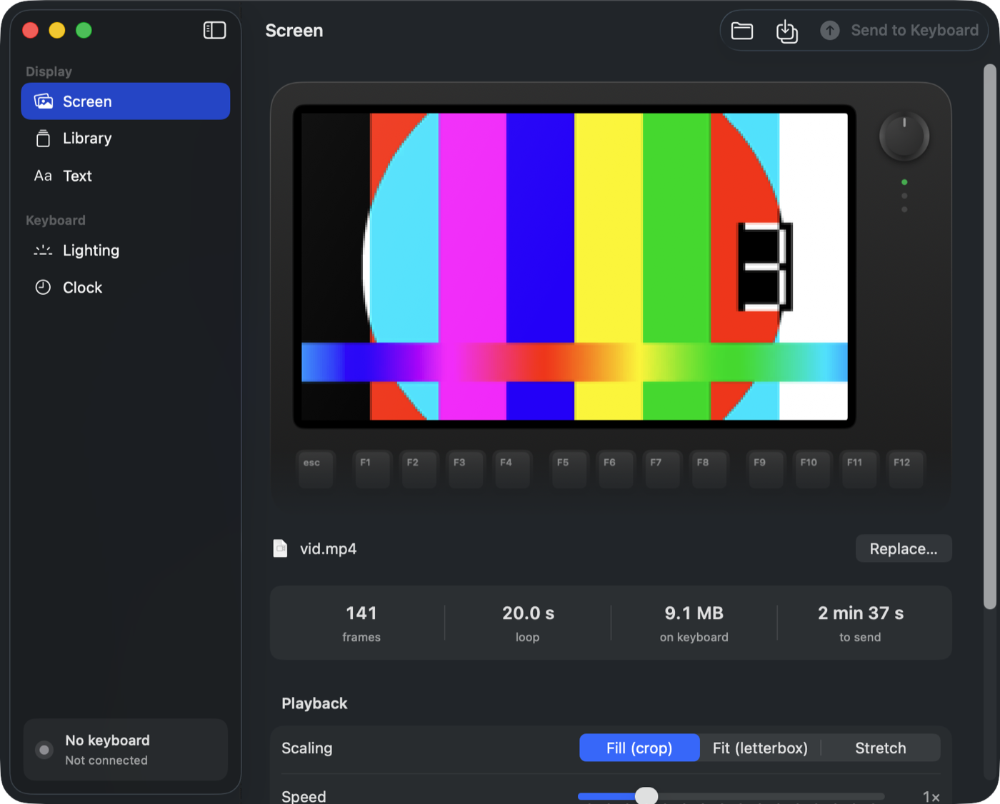
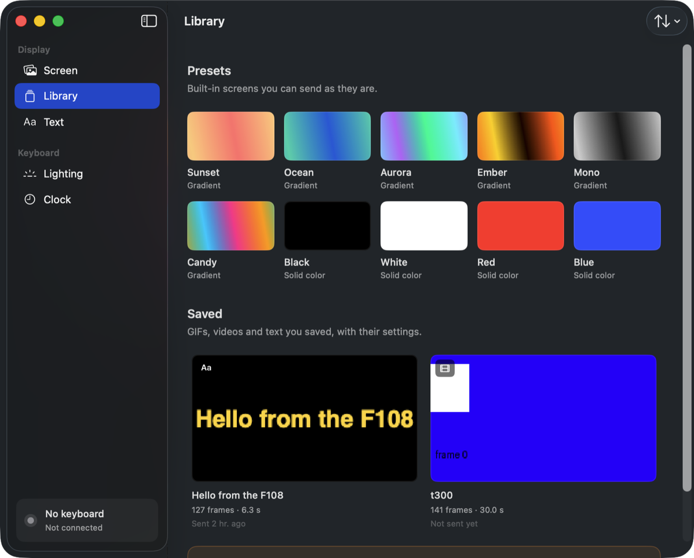
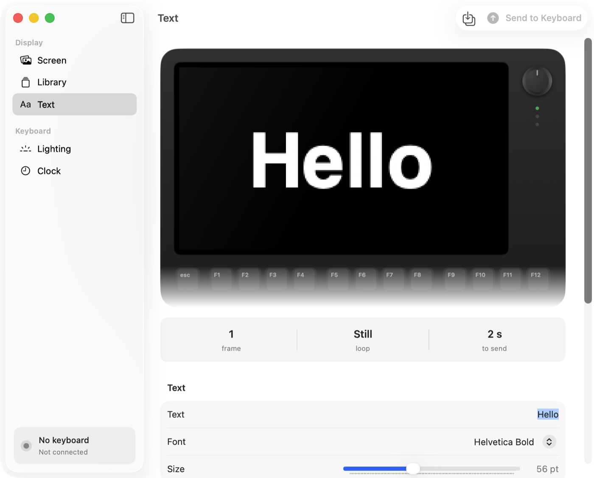
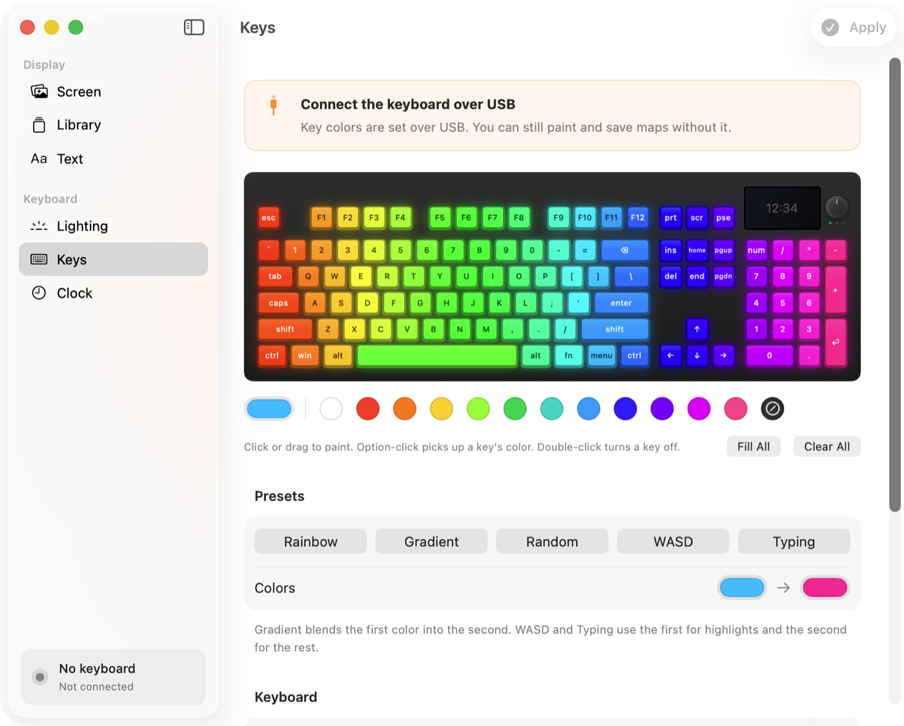
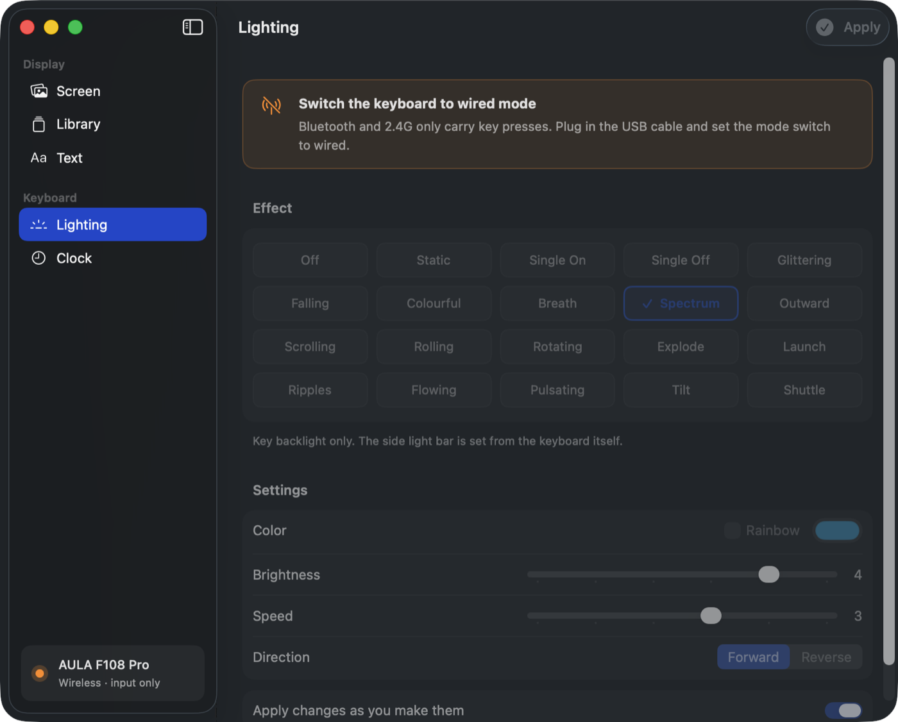

# Aula Studio

Control the screen on your AULA keyboard from macOS. GIFs, video clips, text, lighting and the clock, with no drivers and no Windows VM.



AULA ships Windows-only software for its screen keyboards. This is a native Mac app and command-line tool that speaks the keyboard's USB HID protocol directly through IOKit. Nothing to install beyond the app itself.

**Supported:** AULA F108 Pro, verified on hardware. Other models in the line share the command set and can be added as a profile; see [Adding a model](#adding-a-model).

## Features

- **Screen.** Drop a GIF, PNG, JPEG, WebP, MP4 or MOV. Fill, fit or stretch it, change the playback speed, watch a live preview on a keyboard mockup, then send. Long media is thinned to the keyboard's frame limit while keeping the loop duration.
- **Library.** Everything you save, with thumbnails, remembered settings and one-click resend. Six animated gradients and a few solid colors are built in.
- **Text.** Static or scrolling text rendered on the Mac. Pick a font, size and colors, see it live, send it.
- **Lighting.** All 20 backlight effects with color, brightness, speed and direction, applied as you change them.
- **Keys.** Paint individual keys any color, drag across the board, use presets like rainbow or a WASD layout, and save named maps.
- **Remap.** Change what any key sends, on the normal and Fn layers, stored in the keyboard so it works on every computer. One click for a Mac layout (Cmd next to Space), Caps Lock as Ctrl or Esc, media keys, and more.
- **Clock.** Sets the screen clock to the Mac's time, by default every time you plug the keyboard in.
- **CLI.** Everything above is scriptable with `aula`.

<p>
  
  
</p>
<p>
  
  
</p>

## Install

Download `AulaStudio.zip` from the [latest release](https://github.com/sarequl/aula-keyboard/releases), unzip it and drag `AulaStudio.app` to Applications. The app isn't notarized, so on first launch right-click it and choose Open.

Requires macOS 14 or later.

### Build from source

```bash
git clone https://github.com/sarequl/aula-keyboard.git
cd aula-keyboard
./scripts/bundle.sh
```

That builds `dist/AulaStudio.app`. For only the command-line tool:

```bash
swift build -c release --product aula
```

## Connecting the keyboard

The keyboard accepts configuration **only over the USB cable with the mode switch set to wired**. Over Bluetooth or the 2.4G dongle it just sends key presses; the vendor's own software has the same limit. The app shows the connection state in the sidebar and tells you what to do.

## Command line

```bash
aula status                                    # which model, wired / wireless / not found
aula clock                                     # set the screen clock to now
aula screen cat.gif                            # upload, fill/crop by default
aula screen clip.mp4 fit --fps 12 --speed 1.5
aula screen --color FF00FF                     # solid color
aula text "hello" --scroll 120 --color 00E5FF  # scrolling marquee
aula gradient aurora                           # animated gradient
aula preview cat.gif out.gif                   # what the screen will show, no keyboard needed
aula light breath 00C8FF --brightness 5 --speed 2
aula light spectrum --rainbow
aula modes                                     # list lighting effects
aula keys wasd=00FF00 esc=FF0000 --all 101010  # per-key colors
aula keynames
aula remap --mac                               # cmd next to space, option outside
aula remap capslock=lctrl scrolllock=mute      # any key to any key, modifier or media action
aula remap --reset                             # factory layout on both layers
```

`-v` prints the HID traffic.

## How it works

The F108 Pro's screen is 240×135, RGB565. An upload is a 256-byte header (frame count, then one byte per frame of delay in 20 ms units) followed by raw frames, padded to 4 KB pages. Pages go out as 4096-byte HID output reports on the vendor interface with usage page 0xFF68; the keyboard acknowledges each with a 64-byte input report. Control commands (begin `04 18`, image header `04 72`, apply `04 02`, lighting `04 13`, per-key colors `04 23`, remap `04 11`/`04 27`, clock `04 28`) are 64-byte feature reports on the 0xFF13 interface. Every command must be read back or the firmware drops the next one.

Measured on hardware, a page takes about 150 ms, so a full 141-frame animation (2231 pages) takes around 5.5 minutes. The keyboard then shows its own progress bar while it commits to flash. Don't unplug during either phase.

### The frame limit matters

The firmware does no bounds checking. The F108 Pro's flash slot holds 141 frames; writing more spills into the region that stores the knob-menu graphics and destroys them, with no known recovery. `AulaKit` refuses anything over the profile's limit and thins longer media instead, so this cannot happen through this tool. Never raise `maxFrames` in a profile without a verified source.

## Roadmap

- Macros (`04 15`). The protocol is partly documented in the reference project; on a Mac, Karabiner-Elements or Keyboard Maestro do this better, so it's low priority.
- The side light bar has no HID path on the F108 Pro; it stays Fn-key only.
- Notarized releases, once there's an Apple Developer ID to sign with.

## Adding a model

Other AULA screen keyboards (F99, F87 Pro, S99, F75 Max and friends) use the same command set with different USB ids, screen sizes and flash slots. To add one, append a `KeyboardProfile` in [KeyboardProfile.swift](Sources/AulaKit/KeyboardProfile.swift) with:

- wired VID/PID (`ioreg -p IOUSB -l | grep -A3 -i aula` while plugged in)
- wireless VID/PID, if the model presents one
- screen width and height
- `maxFrames`, taken from `gif_maxframes` in the vendor software's `config.xml` for that model

Leave `verified: false` until an upload has been run on real hardware, then open a PR.

## Project layout

```
Sources/AulaKit      profiles, protocol, IOKit transport, media decoding, generators, library store
Sources/aula         command-line tool
Sources/AulaStudio   SwiftUI app
scripts/bundle.sh    builds the .app bundle
scripts/make-icon.swift  regenerates the app icon
```

`AulaKit` has no dependencies and can be used on its own.

## Credits

The protocol comes from [parsiya/f108-pro](https://github.com/parsiya/f108-pro): Ghidra work on the Windows driver, USB captures and hardware verification, including the flash-overflow finding above. This project would not exist without it.

## License

MIT. See [LICENSE](LICENSE).
